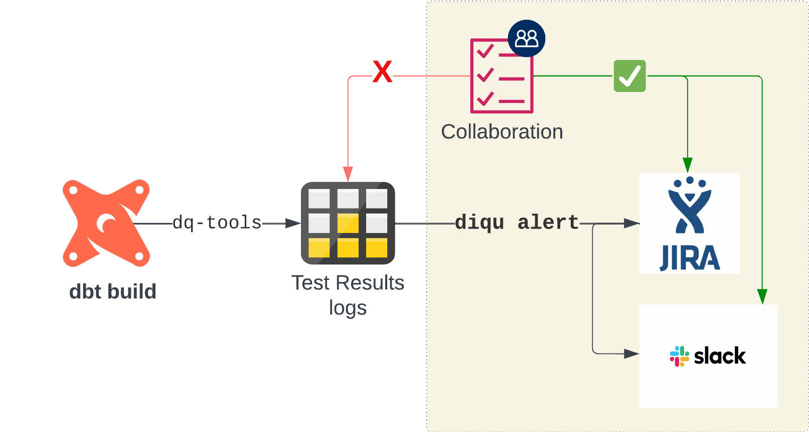

# diqu

[](https://diqu.iflambda.com/latest/)
[](https://pypi.org/project/diqu/)
[](https://opensource.org/license/apache-2-0/)

[](https://www.python.org)
[](https://codecov.io/gh/infinitelambda/diqu)

Automate and streamline the alerting/ notification process for dbt test results using this versatile CLI companion tool. Receive detailed alerts & test metadata seamlessly on various platforms, promoting improved collaboration on dbt project issues 🐞🚀.

## Who is this for

This tool is designed for individuals or teams seeking to automate the management of their dbt project issues (test warnings, errors... etc) outside the dbt environment.

## Features

- Automated alerts and notifications based on recorded dbt test results.
- Built-in support for dq-tools and custom query input.
- Auto-labels `deprecated` tests for quick & easy identification.
- Creates and updates Jira tickets with the latest tests' metadata.
- Sends succinct and informative messages to a dedicated Slack channel.

> **dbt alert rant 🟢 🟡 🔴 ⚫** </br></br>
> _"Run errors are red,_</br>
> _Test warnings are yellow,_</br>
> _Where's my bug alert,_</br>
> _And joint bugfix workflow?"_</br></br>
> _-- by `diqu` OG Contributors_ </br>

 <!-- markdownlint-disable no-inline-html -->

### Supported Modules

- Sources (DWH connections)
  - Snowflake
  - CSV file
- Package (parsing dbt test results)
  - [](https://hub.getdbt.com/infinitelambda/dq_tools)
  - Custom query
- Alert Modules (alert/ notification)
  - Jira
  - Slack

## Installation

```bash
pip install diqu [--upgrade]
```

📓 _NOTE_: The required Data Warehouse (DWH) module should already be installed if you are using `diqu` in a working dbt project. If not, please perform additional steps to install these DWH modules.
For example, if you're using Snowflake:

```bash
pip install "snowflake-connector-python[pandas]"
pip install "snowflake-connector-python[secure-local-storage]"
```

## Usage

<details> <!-- markdownlint-disable no-inline-html -->
  <summary>preflight</summary>

  ```bash
  # define the query params
  export ISSUE_DEPRECATED_WINDOW_IN_DAYS=your_issue_deprecation_time_in_day, default to "3"
  export ISSUE_UPDATE_WINDOW_IN_DAYS=your_issue_historical_data_update_window_in_days, default to "14"

  # build dq-tools log table
  dbt run -s dq_tools
  ```

</details>

  ```bash
  diqu alert --to slack --to jira
  ```

```log
04:33:17  diqu: INFO - Run with diqu==1.0.0 🏃
04:33:19  diqu: INFO - Using dbt project at: /path/to/dbt/project
04:33:19  diqu: INFO - Using dbt profiles.yml at: ~/.dbt
04:33:19  diqu: INFO - Using snowflake connection
04:33:19  diqu: INFO - Looking for the query in: ./dq_tools__get_test_results.sql
04:33:23  diqu: INFO - Alerting to: SLACK
04:33:23  diqu: INFO - ✅ Done > Slack
04:33:23  diqu: INFO - Alerting to: JIRA
04:33:23  diqu: INFO - ✅ Done > JIRA
```

## Alert Modules Configurations

### Slack

- Use the environment variables to configure the Slack Channel:

    ```bash
    export SLACK_TOKEN=your_token
    export SLACK_CHANNEL=your_channel_name
    
    diqu alert --to slack
    ```

### Jira Board

- Use the environment variables to configure the JIRA Board:

    ```bash
    export JIRA_SERVER=your_jira_server e.g. https://your_value.atlassian.net/
    export JIRA_AUTH_USER=your_service_account e.g. dqt_user@your_value.com
    export JIRA_AUTH_PASSWORD=your_service_token e.g. ATATTxxxxx
    export JIRA_PROJECT_ID=your_project_id e.g. 106413
    export JIRA_ISSUE_TYPE=your_issue_type, default to "Bug"
    export JIRA_OPEN_ISSUES_FILTER_BY_SUMMARY=your_issue_filter_on_title, default to "dq-tools"

    diqu alert --to jira
    ```

📖 For more details, please visit [the documentation site](https://diqu.iflambda.com/latest/).

## Quick Demo

[](https://www.loom.com/share/8d970dfe333c450f8f6d3859458cac99?sid=b5542b91-ca6d-42a9-b80f-55f85674ec21)

## How to Contribute

This Auto Alert (`diqu`) tool is an open-source software. Whether you are a seasoned open-source contributor or a first-time committer, we welcome and encourage you to contribute code, documentation, ideas, or problem statements to this project.

👉 See [CONTRIBUTING guideline](https://diqu.iflambda.com/latest/nav/dev/contributing.html) for more details or check out [CONTRIBUTING.md](./CONTRIBUTING.md)

🌟 And then, kudos to **our beloved Contributors**:

<a href="https://github.com/infinitelambda/diqu/graphs/contributors">
  
</a>

## About Infinite Lambda

Infinite Lambda is a cloud and data consultancy. We build strategies, help organizations implement them, and pass on the expertise to look after the infrastructure.

We are an Elite Snowflake Partner, a Platinum dbt Partner, and two-times Fivetran Innovation Partner of the Year for EMEA.

Naturally, we love exploring innovative solutions and sharing knowledge, so go ahead and:

🔧 Take a look around our [Git](https://github.com/infinitelambda)

✏️ Browse our [tech blog](https://infinitelambda.com/category/tech-blog/)

We are also chatty, so:

👀 Follow us on [LinkedIn](https://www.linkedin.com/company/infinite-lambda/)

👋🏼 Or just [get in touch](https://infinitelambda.com/contacts/)

[](https://infinitelambda.com/)
